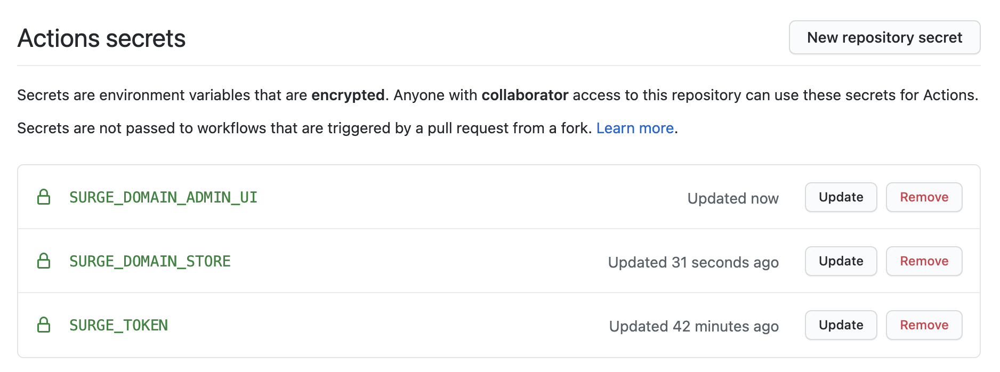

### 🎈 Lab 21 - Setting up CD for automatic deployment

###### ⏰ Estimated time: 10-20 minutes

#### 📚 Learning outcomes:

- Understand how to configure a simple Continuous Deployment system using Nx and GitHub actions
- Learn how to expose custom secrets on GitHub to your CD processes 

#### 🏋️‍♀️ Steps :

In this lab we'll be setting up GitHub actions to build and deploy our projects whenever changes go into the `master` branch.

1. Add a `.github/workflows/deploy.yml` file
2. Using your `ci.yml` config as an example, see if you can configure automated deployments from the 
`master` branch:

   Anytime we push or merge something to the `master` branch it should:
   - build the `store` and `admin-ui` for production
   - deploy the `store` and `admin-ui`
       
   We'll start you off:
   
   ```
   name: Deploy Website
   
   on:
     push:
       branches:
         - master <-- workflow will run everytime we push or merge something to master
   jobs:
     build:
       runs-on: ubuntu-latest
       name: Deploying apps
       steps:
        .... <-- ADD THE STEPS HERE
   ```

2. Our "deploy" targets are using some secret ENV variables though. We'll need to make these available on GitHub:
    1. Go to your GitHub workshop repo
    2. Click on **"Settings"** at the top
    3. Then **"Secrets"** on the left menu bar
    4. Add values for all the variables we've been keeping in `.local.env` files
  
    

3. Then back in our `deploy.yml` file, let's expose these secrets to the processes (use `ci.yml` as an example of where to put these):

    ```
    env:
      SURGE_DOMAIN_STORE: ${{ secrets.SURGE_DOMAIN_STORE }}
      SURGE_DOMAIN_ADMIN_UI: ${{ secrets.SURGE_DOMAIN_ADMIN_UI }}
      SURGE_TOKEN: ${{ secrets.SURGE_TOKEN }}
    ```

3. Since we'll be re-deploying, we want to test if we're looking at a new version of our code:
    - Make a change to your AdminUI (maybe change the text in the header)
    - Make a change to your Store (maybe change the title in the header) 
3. Commit everything locally on `master` and then push (it's important we push to the `master` branch)
4. You should see your new workflow start up under the "Actions" tab on your GitHub repo
5. Once it's done, navigate to your frontend Surge deployment URLs and test if you notice the new changes

---

🎓 If you get stuck, check out [the solution](SOLUTION.md)

---

[➡️ Next lab ➡️](../lab22/LAB.md)
