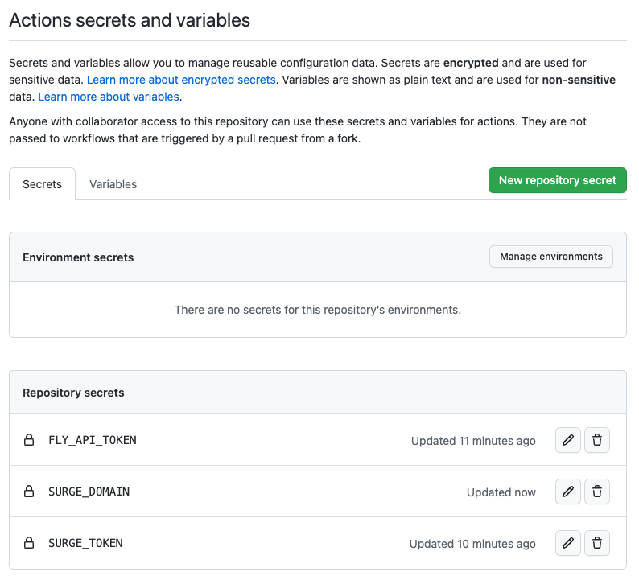

# 🎈 Lab 21 - Setting up CD for automatic deployment

###### ⏰ Estimated time: 10-20 minutes
<br />

## 📚 Learning outcomes:

- **Understand how to configure a simple Continous Deployment system using Nx and GitHub actions**
- **Learn how to expose custom secrets on GitHub to your CD processes**

## 🏋️‍♀️ Steps :

1. Add a `.github/workflows/deploy.yml` file
   <br /> <br />
2. Using your `ci.yml` config as an example, see if you can configure automated deployments from the `main` branch:

   Anytime we push or merge something to the `main` branch it:
   - builds the `store` and `api` for production
   - deploys the `store` and `api`
       
   We'll start you off:
   
   ```yml
   name: Deploy Website
   
   on:
     push:
       branches:
         - main <-- workflow will run everytime we push or merge something to `main`
   jobs:
     build:
       runs-on: ubuntu-latest
       name: Deploying apps
       steps:
        .... <-- ADD THE STEPS HERE
   ```
   <br />

3. Our "deploy" targets are using some secret ENV variables though. We'll need to make these available on GitHub:
    1. Go to your GitHub workshop repo
    2. Click on **"Settings"** at the top
    3. Then **"Secrets"** on the left menu bar
    4. Add values for all the variables we've been keeping in `.local.env` files
    
    
    <br /> <br />

4. Then back in our `deploy.yml` file, let's expose these secrets to the processes (use `ci.yml` as an example of where to put these):

    ```yml
    env:
      SURGE_DOMAIN: ${{ secrets.SURGE_DOMAIN }}
      SURGE_TOKEN: ${{ secrets.SURGE_TOKEN }}
      FLY_API_TOKEN: ${{ secrets.FLY_API_TOKEN }}
    ```
    <br />

5. Since we'll be re-deploying, we want to test if we're looking at a new version of our code:
    - Make a change to your API (maybe change the name of one of the games)
    - Make a change to your Store (maybe change the title in the header) 
    <br /> <br />
6. Commit everything locally on `main` and then push (it's important we push to the `main` branch as that's where our workflow runs)
   <br /> <br />
7. You should see your new workflow start up under the "Actions" tab on your GitHub repo
   <br /> <br />
8. Once it's done, navigate to your frontend Surge deployment URL and test if you notice the new changes (the ones you made to the Store and also to the API)
   <br /> <br />

---

🎓 If you get stuck, check out [the solution](SOLUTION.md)

---

[➡️ Next lab ➡️](../lab22/LAB.md)
